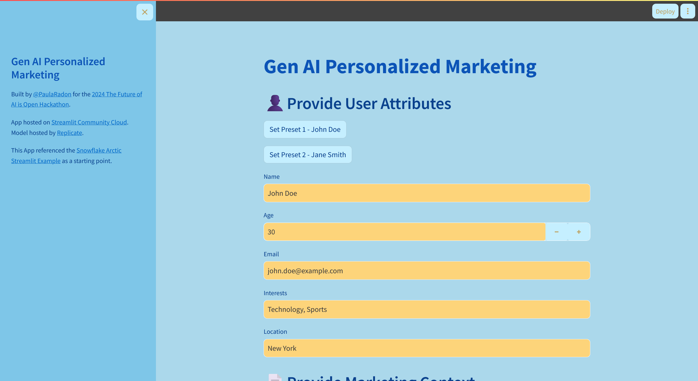
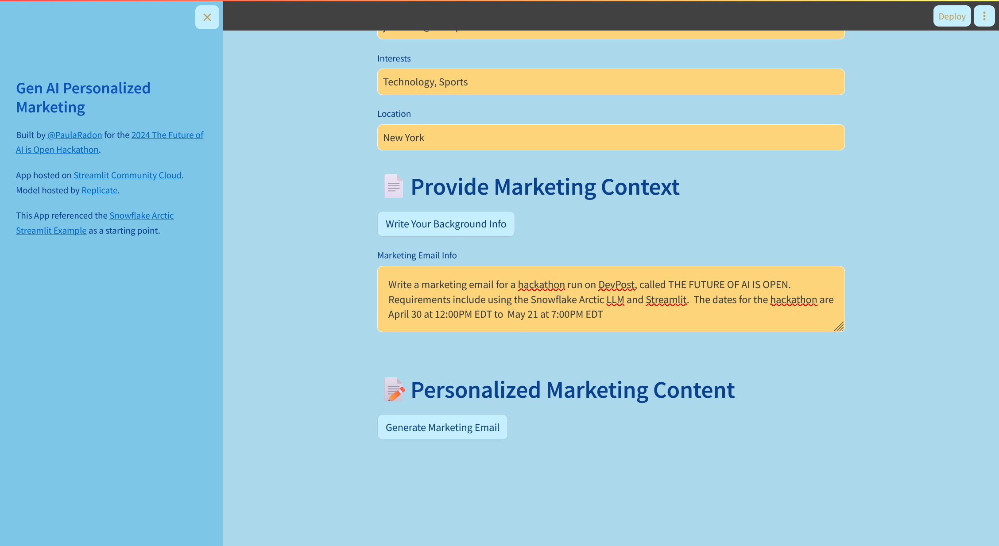
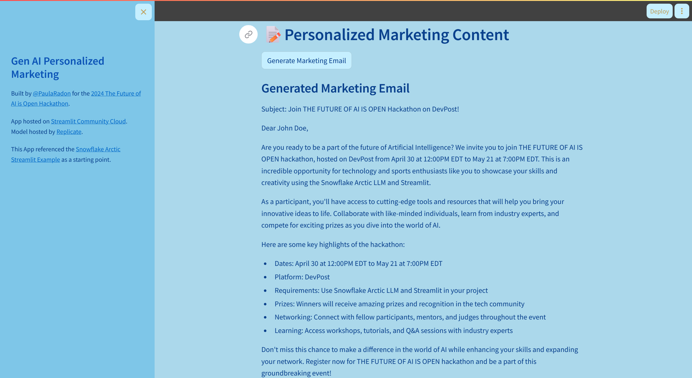

# Gen AI Personalized Marketing

## Inspiration
In the ever-evolving world of digital marketing, personalization is key to engaging customers and delivering relevant content. The idea for this project was born out of the need to create a more interactive and personalized experience for marketing campaigns. By leveraging generative AI, we aimed to build a system that could tailor marketing materials to individual preferences and behaviors, enhancing customer engagement and driving better results.

## What it does
Our project uses Streamlit to create a user-friendly interface for inputting and managing customer data. The system allows marketers to input various attributes about a person, such as their name, age, email, interests, and location. With the click of a button, these attributes can be set to predefined values, making it easy to create different marketing personas.

The true power of this project comes from integrating Snowflake Arctic LLM, a generative AI model hosted on Replicate. This model analyzes the input data and generates personalized marketing content, such as email templates, social media posts, and product recommendations, tailored to the individual's preferences and behaviors.

### UI

### Input

### Output

## How we built it
Streamlit Interface: We used Streamlit to build a simple and interactive web application. This interface allows users to input and manage customer data easily.

Streamlit Cloud: To make our application accessible and scalable, we deployed it on Streamlit Cloud. This platform provided a seamless way to host our application and share it with team members and stakeholders.

Snowflake Arctic LLM: The core of our personalization engine is the Snowflake Arctic LLM. This generative AI model, hosted on Replicate, processes the input data and generates customized marketing content. We used APIs to integrate this powerful model with our Streamlit application.

## What we learned
Power of Generative AI: We learned a great deal about the capabilities and potential of generative AI models, particularly in creating personalized content that resonates with individual customers.

Importance of User Experience: The project reinforced the importance of creating a user-friendly interface that simplifies complex processes and enhances the overall user experience.

Challenges of Data Integration: Integrating various tools and platforms to create a seamless workflow is challenging but crucial for building effective solutions.

## What's next for Personalized Marketing
Enhanced Personalization: We plan to further refine the personalization algorithms and improve the quality of the generated content. This includes incorporating more customer data points and using advanced analytics to better understand customer preferences.